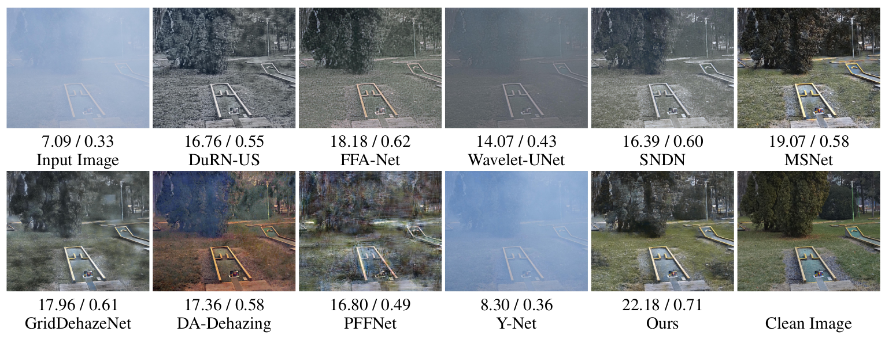
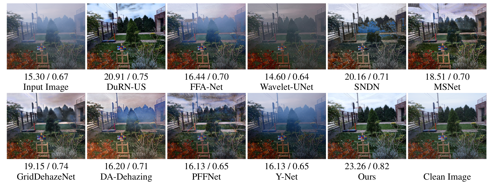

## [STATUS - ACTIVE]
## [DIDH] - Towards Domain Invariant Single Image Dehazing
Official Pytorch based implementation.

#
### To-Do List  
- [ ] Paper Link
- [ ] Training Code
- [x] Trained Models
- [x] Trained Models corresponding to experiments
- [ ] Citation

#
## Results

<p align="center">
    
    <em>Standard Performance Evaluation of different Dehazing algorithms on NTIRE-19 dataset</em>
</p>


<p align="center">
    
    <em>Blind Evaluation of different Dehazing algorithms on NTIRE-18 dataset</em>
</p>

#
### Dependencies and Installation
* python=3.8
* PyTorch=1.6
* tqdm
* numpy
* matplotlib
* PIL
* [piq](https://github.com/photosynthesis-team/piq)
* OpenCV=4.4

#
## Dataset Details
| Dataset Name | PSNR / SSIM | Resolution | Type  | Paper Link |
|--------|:----------:|:---------:|:---------:|:---------:|
| I-Haze [NTIRE-18](https://data.vision.ee.ethz.ch/cvl/ntire18//i-haze/) | 14.60 / 0.67 | 4177 x 3134 | Real | [paper](http://www.vision.ee.ethz.ch/ntire18/i-haze/I-HAZE.pdf)|
| O-Haze [NTIRE-18](https://data.vision.ee.ethz.ch/cvl/ntire18//o-haze/) | 14.60 / 0.67 | 4177 x 3134 | Real | [paper](http://www.vision.ee.ethz.ch/ntire18/o-haze/O-HAZE.pdf)|
| [NTIRE-19](https://data.vision.ee.ethz.ch/cvl/ntire19/) |  9.11 / 0.49 | 1600 x 1200 | Real |[paper](https://openaccess.thecvf.com/content_CVPRW_2019/papers/NTIRE/Ancuti_NTIRE_2019_Image_Dehazing_Challenge_Report_CVPRW_2019_paper.pdf)|
| [NTIRE-20](https://competitions.codalab.org/competitions/22236) | 10.42 / 0.46 | 1600 x 1200 | Real | [paper](https://arxiv.org/pdf/2005.03457.pdf)|
| [SOTS-IN](https://sites.google.com/view/reside-dehaze-datasets/reside-v0)  | 11.97 / 0.69 |  620 x 460  | Synthetic | [paper](https://arxiv.org/pdf/1712.04143.pdf)|
| [SOTS-OUT](https://sites.google.com/view/reside-dehaze-datasets/reside-v0) | 15.92 / 0.81 |  550 x 478  | Synthetic | [paper](https://arxiv.org/pdf/1712.04143.pdf)|
| [HazeRD](https://labsites.rochester.edu/gsharma/research/computer-vision/hazerd/)   | 14.60 / 0.67 | 3492 x 2558 | Synthetic | [paper](http://www2.ece.rochester.edu/~gsharma/papers/Zhang_ICIP2017_HazeRD.pdf)|


#
## MODEL ZOO - Checkpoints of Networks 

### Trained on Synthetic (RESIDE-Indoor) dataset ->  [Trained_Models]()

| Model  | SOTS-IN (PSNR / SSIM)| SOTS-OUT (PSNR / SSIM) | NTIRE-19 (PSNR / SSIM) | NTIRE-20 (PSNR / SSIM)|
|--------|:----------:|:----------:|:----------:|:----------:|
|DuRN-US | 32.12 / 0.98 | 19.55 / 0.83 | 10.81 / 0.51 | 11.27 / 0.51 |
|FFA-Net | 36.36 / 0.98 | 20.05 / 0.84 | 10.97 / 0.42 | 10.70 / 0.44 |
|Wavelet-UNet | 20.02 / 0.75 | 17.75 / 0.67 | 11.48 / 0.47 | 10.88 / 0.36|
|MSNet | 32.04 / 0.98 | 20.70 / 0.86 |  9.90 / 0.51 | 11.16 / 0.51 |
|SNDN | 24.68 / 0.91 | 16.02 / 0.69 | 10.13 / 0.45 | 10.64 / 0.43 |
|GridDehazeNet | 32.14 / 0.98 | 16.22 / 0.76 | 9.50 / 0.49 | 9.01 / 0.40 |
|PFFNet | 26.58 / 0.92 | 14.63 / 0.65 | 11.38 / 0.51 | 11.14 / 0.43|
|Ours | 38.91 / 0.98 | 25.75 / 0.84| 16.21 / 0.78 | 16.28 / 0.67 |

### Trained on Synthetic (RESIDE-Outdoor) dataset ->  [Trained_Models]()
| Model  | SOTS-IN (PSNR / SSIM)| SOTS-OUT (PSNR / SSIM) | NTIRE-19 (PSNR / SSIM) | NTIRE-20 (PSNR / SSIM)|
|--------|:----------:|:----------:|:----------:|:----------:|
|DuRN-US | 15.95 / 0.76 | 19.41 / 0.81 | 11.04 / 0.51 | 11.73 / 0.46 |
|FFA-Net | 18.96 / 0.86 | 30.88 / 0.93 | 9.64 / 0.50 | 10.90 / 0.48 | 
|Wavelet-UNet | 16.26 / 0.73 | 21.95 / 0.76 | 10.36 / 0.49 | 11.05 / 0.43 |
|MSNet | 21.75 / 0.88 | 29.80 / 0.93 | 09.56 / 0.48 | 11.35 / 0.51 |
|SNDN | 25.30 / 0.91 | 24.31 / 0.88 | 11.74 / 0.49 | 11.95 / 0.52 |
|GridDehazeNet | 20.99 / 0.89 | 29.18 / 0.93 | 10.16 / 0.50 | 11.23 / 0.49 |
|PFFNet | 20.32 / 0.85 | 27.65 / 0.91 | 10.75 / 0.50 | 11.55 / 0.52 |
|Ours | 26.90 / 0.76 | 30.40 / 0.94 | 13.36 / 0.52 | 12.68 / 0.52 |

### Trained on Real (NTIRE-19) dataset ->  [Trained_Models](https://github.com/PS06/DIDH/releases/download/ntire_19_v1.0/ntire_19.zip)
| Model  | SOTS-IN (PSNR / SSIM)| SOTS-OUT (PSNR / SSIM) | NTIRE-19 (PSNR / SSIM) | NTIRE-20 (PSNR / SSIM)|
|--------|:----------:|:----------:|:----------:|:----------:|
|DuRN-US | 11.44 / 0.59 | 13.05 / 0.61 | 13.63 / 0.57 | 12.97 / 0.52 |
|FFA-Net | 12.16 / 0.55 | 14.36 / 0.59 | 14.01 / 0.56 | 14.71 / 0.57 |
|Wavelet-UNet | 13.57 / 0.41 | 13.05 / 0.44 | 12.85 / 0.39 | 12.08 / 0.24 | 
|MSNet | 13.33 / 0.55 | 13.85 / 0.56 | 13.32 / 0.53 | 12.63 / 0.32 |
|SNDN | 12.56 / 0.66 | 14.11 / 0.70 | 13.54 / 0.54 | 14.93 / 0.51 |
|GridDehazeNet | 14.57 / 0.59 | 13.47 / 0.60 | 12.96 / 0.50 | 12.07 / 0.32 |
|PFFNet | 13.51 / 0.50 | 14.57 / 0.53 | 13.29 / 0.52 | 12.99 / 0.31 |
|Ours | 19.28 / 0.66 | 18.17 / 0.87 | 19.47 / 0.75 | 20.33 / 0.77 |

### Trained on Real (NTIRE-20) dataset ->  [Trained_Models]()
| Model  | SOTS-IN (PSNR / SSIM)| SOTS-OUT (PSNR / SSIM) | NTIRE-19 (PSNR / SSIM) | NTIRE-20 (PSNR / SSIM)|
|--------|:----------:|:----------:|:----------:|:----------:|
|DuRN-US | 9.43 / 0.63 | 11.92 / 0.66 | 11.63 / 0.52 | 15.27 / 0.50 |
|FFA-Net | 9.96 / 0.63 | 14.88 / 0.75 | 12.43 / 0.52 | 18.11 / 0.66 |
|Wavelet-UNet | 12.04 / 0.32 | 13.85 / 0.41 | 11.46 / 0.28 | 12.08 / 0.21 |
|MSNet | 9.16 / 0.51 | 10.66 / 0.56| 12.04 / 0.50| 14.06 / 0.50 |
|SNDN | 12.03 / 0.67 | 14.14 / 0.73 | 11.73 / 0.52 | 13.93 / 0.52 |
|GridDehazeNet | 11.60 / 0.58 | 12.75 / 0.72 | 13.39 / 0.52 | 15.32 / 0.60 |
|PFFNet | 8.82 / 0.47 | 12.00 / 0.53 | 11.54 / 0.49 | 14.50 / 0.36 |
|Ours | 19.53 / 0.71 | 18.69 / 0.79 | 17.24 / 0.66 | 21.17 / 0.78 |

### Trained on Aggregated dataset ->  [Trained_Models]()
| Model  | SOTS-IN (PSNR / SSIM)| SOTS-OUT (PSNR / SSIM) | NTIRE-19 (PSNR / SSIM) | NTIRE-20 (PSNR / SSIM)|
|--------|:----------:|:----------:|:----------:|:----------:|
|DuRN-US | 26.80 / 0.95 | 29.59 / 0.91 | 15.96 / 0.61 | 19.88 / 0.69 |
|FFA-Net | 19.15 / 0.85 | 25.53 / 0.89 | 14.06 / 0.54 | 15.93 / 0.59 |
|Wavelet-UNet | 15.46 / 0.65  | 19.21 / 0.67 | 12.23 / 0.51 | 12.66 / 0.42 |
|MSNet | 24.38 / 0.90 | 26.79 / 0.90 | 14.65 / 0.59 | 15.17 / 0.63 |
|SNDN | 22.94 / 0.88 | 25.49 / 0.89 | 14.66 / 0.59 | 18.65 / 0.67 |
|GridDehazeNet | 22.87 / 0.91 | 27.18 / 0.91 | 13.97 / 0.56 | 17.02 / 0.68 |
|PFFNet | 23.39 / 0.87 | 25.80 / 0.87 | 13.50 / 0.48 | 14.77 / 0.57 |
|Ours | 25.39 / 0.80 | 19.47 / 0.75 | 22.80 / 0.82 | 23.66 / 0.88 |


### Blind Evaluation on Haze-RD and NTIRE-18 dataset
| Algorithm | Haze-RD (PSNR/SSIM) | NTIRE-18 (PSNR/SSIM) |
|----------|:----------:|:----------:|
| DuRN-US | 15.26 / 0.83 | 18.85 / 0.71 |
| FFA-Net | 15.77 / 0.83 | 16.16 / 0.64 |
| Wavelet | 16.30 / 0.82 | 16.01 / 0.70 |
| MSNet | 14.42 / 0.80 | 17.42 / 0.66 |
| SNDN | 16.05 / 0.82 | 18.08 / 0.70 |
| GridDehazeNet | 14.58 / 0.81 | 18.26 / 0.74 |
| PFFNet | 15.20 / 0.77 | 15.66 / 0.58 |
| DA-Dehaze | 16.21 / 0.78 | 16.28 / 0.67 |
| Ours | 21.42 / 0.81 | 24.14 / 0.80 |


#
## Code Details

### Create a 1-1 list corresponding to ground truth and hazy image
1. Update location of datasets in gen_paired_datasets.py
2. Comment out datasets that are not needed and run,

```
python gen_paired_dataset.py
```

### Working of [Greedy Localized Data Augmentation](https://github.com/PS06/GLDA)
To see how localized data augmentation works, 
```
python dataloader.py
```

### Train
```
python train.py
```

### Test
```
python eval.py
```


